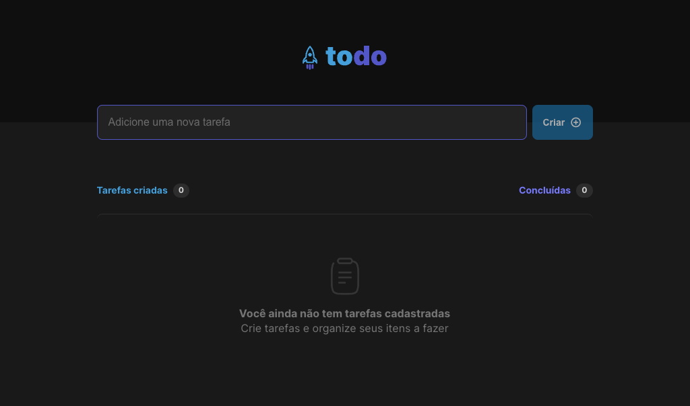
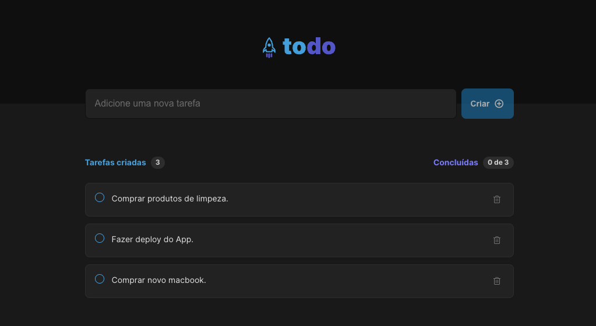
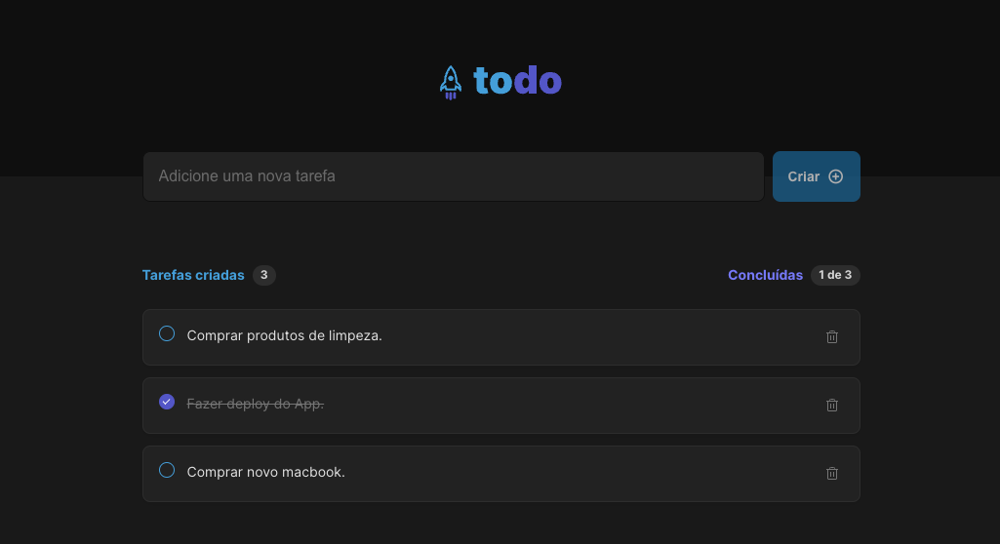

<h1 align="center">
  
</h1>

<h3 align="center">
Aplicação de todo list para controlar suas tarefas.
</h3>
<h5 align="center">
  Feito com ReactJS + Vite +  TypeScript
</h5>


<p align="center">
  
  
   <a href="https://www.linkedin.com/in/carlosoliveiradev/">
    
  </a>
  <a href="https://github.com/burn-c/goeat-api/stargazers">
    
  </a>
</p>

<p align="center">
  <a href="#---instalar-e-executar">Instalar e executar</a>&nbsp;&nbsp;&nbsp;|&nbsp;&nbsp;&nbsp;
  <a href="#-frontend">Frontend</a>&nbsp;&nbsp;&nbsp;|&nbsp;&nbsp;&nbsp;
  <a href="#-telas">Telas</a>&nbsp;&nbsp;&nbsp;|&nbsp;&nbsp;&nbsp;
  <a href="#-tecnologias">Tecnologias</a>
</p>

<hr>

<h1 align="center">
  ⚙ Instalar e executar
</h1>


## 🖥 Frontend

1. Clonar repositório:

```sh
git clone https://github.com/burn-c/ignite-todo.git
```
2. Entre na pasta do projeto clonado e instale às dependências utilizando o comando:

```sh
yarn ou npm install
```

3. Executar o projeto:

```sh
yarn dev ou npm dev
```
## 🖥️ Telas
<div align='center'>
  
  
  
</div>

## 🛠 Tecnologias

O projeto foi desenvolvido com as seguintes tecnologias:

-  [Node.js](https://nodejs.org/)
-  [ReactJS](https://reactjs.org/)
-  [Vite](https://vitejs.dev/)
-  [TypeScript](https://www.typescriptlang.org/)
-  [CSS3](https://www.w3.org/Style/CSS/Overview.en.html)
-  [Phosphor Icons](https://phosphoricons.com/)
-  [uuid](https://github.com/uuidjs/uuid)
-  [ESLint](https://eslint.org/)
-  [Prettier](https://prettier.io/)
-  [VS Code](https://code.visualstudio.com/)

---

Encontrou algum erro ? Tem alguma dica ? Enviei uma pull request! Ficarei feliz em receber! 😁

Made with 🔥 by Carlos Oliveira ( BurN  ) - [My linkedin!](https://www.linkedin.com/in/carlosoliveiradev/)